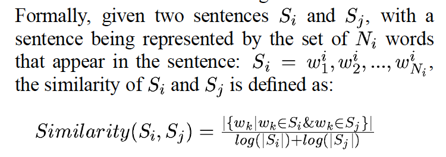

# CMPE 251 : Data Science and Social Media Analysis

Course [Web Site](https://ects.bilgi.edu.tr/Course/Detail?catalog_courseId=3803945). I suggest you to watch online course [Analytics in Python](https://courses.edx.org/courses/course-v1:ColumbiaX+BAMM.101x+2T2017/course/)

## Topics Covered So Far

0. Introduction
 - [Python](http://nbviewer.jupyter.org/github/uzay00/CMPE251/blob/master/Lecture1%20and%202/Very%20First%20Lecture%20%20-%20Python%20Programming.ipynb) and [Libraries](http://nbviewer.jupyter.org/github/uzay00/CMPE251/blob/master/Lecture%204/Pandas%20Functions%20and%20Outlier%20removal%20in%20Python%20using%20IQR%20rule.ipynb)
 - [Machine Learning](http://nbviewer.jupyter.org/github/uzay00/CMPE251/blob/master/Lecture1%20and%202/byoyo2018-giris-1.ipynb)
 - Data Science: [Getting Data From Twitter](http://nbviewer.jupyter.org/github/uzay00/CMPE251/blob/master/Lecture%203/Intro%202%20Twitter%20Data%20Analysis.ipynb)
1. Compare Basic Machine Learning Algorithms
 - LinearRegression
 - [LogisticRegression](http://nbviewer.jupyter.org/github/uzay00/CMPE251/blob/master/Lecture%204/Titanic.ipynb)
 - Decision Tree
 - _Application_: [Introduction](http://nbviewer.jupyter.org/github/uzay00/CMPE251/blob/master/Lecture%204/Intro%20to%20ML.ipynb) and [Test on synthethic data](http://nbviewer.jupyter.org/github/uzay00/CMPE251/blob/master/Lecture6/Compare%20ML%20algorithms.ipynb)
 
 
2. Anomaly Detection [Kaggle Kernel](https://www.kaggle.com/pavansanagapati/anomaly-detection-credit-card-fraud-analysis)
 - [3 Sigma Rule](http://nbviewer.jupyter.org/github/uzay00/CMPE251/blob/master/Lecture%204/9%20-%20Simple%20Anomaly%20Detector%20in%20Real%20Time.ipynb) and [link](http://nbviewer.jupyter.org/github/uzay00/CMPE251/blob/master/Lecture%204/Normal%20Distribution%20and%203%20Sigma%20Rule.ipynb)
 - [Isolation Forest](http://nbviewer.jupyter.org/github/uzay00/CMPE251/blob/master/Lecture6/Isolation%20Forest.ipynb)
 - _Application_ : [Google Trend Data](https://trends.google.com.tr/trends/explore?date=today%205-y&geo=TR&q=darbe)

3. Intro 2 Text Mining
 - [TF-IDF explained](http://nbviewer.jupyter.org/github/uzay00/CMPE251/blob/master/Lecture5/TF-IDF/TF-IDF%20Explained.ipynb)
 - [Creating Text Mining Model](http://nbviewer.jupyter.org/github/uzay00/CMPE251/blob/master/Lecture5/Intro2TextMining/1-Create%20Text%20Mining%20Model.ipynb)
 - [Test on Twitter with pre-trained model](http://nbviewer.jupyter.org/github/uzay00/CMPE251/blob/master/Lecture5/Intro2TextMining/2-Test%20predefined%20model%20on%20a%20new%20data.ipynb)

4. Text Summarization
 - Algorithm to Extract Summary
 - _Application_ : [Summary of Wikipedia page](http://nbviewer.jupyter.org/github/uzay00/CMPE251/blob/master/Lecture7/Text%20summarization/Text%20Summarization.ipynb)
 
5. Web Scraping
 - _Application_ : ukitap
 
     
## Projects

As course advances we will add more alternative projects. You must do at least one project. You can also propose a new project. 

Below you can find the link for determining your project groups.
 - http://bit.ly/CMPE251Projects18
 
Use this link to write the name of the project, your data source and your team mates and the name of your team.

> The most critical part of your project is the correctness of your traninig labeled data. If your data is not good, you will receive very low points. 

 
### 1. Sentiment Analysis On EksiSozluk

__Data Collection__
You will get data from eksisozluk with web scraper. Each student will label 500 comments on eksi. 5 label means 5 class.
 - 5 Very Positive
 - 4 Positive
 - 3 Neutral
 - 2 Negative
 - 1 Very Negative
 
Each group MUST have different data sources. Different "gundem" topics from Eksisozluk.
 
 __Machine Learning__
 Use ML algorithms for Sentiment Analysis On EksiSozluk. Indicate your results.
 
   
 ### 2. Fake News Detection
 
__Data Collection__
You will get data from Zaytung and normal newspapers websites with web scraper. 

 - Zaytung news: 1
 - Normal newspapers: 0

 
 __Machine Learning__
 Use ML algorithms for Sentiment Analysis On EksiSozluk. Indicate your results.
 
   
 ### 3. Create a New Elvis Presley Song Lyric
 __Data Collection__
Use NRC [Emotion Lexicon](https://saifmohammad.com/WebPages/nrc-vad.html) and Kaggle [song lyrics](https://www.kaggle.com/mousehead/songlyrics) dataset

 
 __Machine Learning__
Use __textrank algorithm__ to create a new song lyric from a popular singer. 
Then use it to create a combined lyric of various singers.

> we are defining a different relation, which determines a connection between two sentences if there is a “similarity” relation between them, where “similarity” is measured as a function of their content overlap.

  

